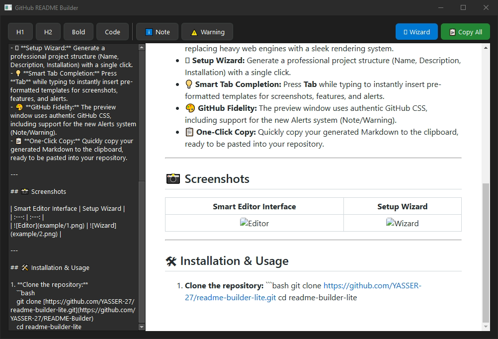
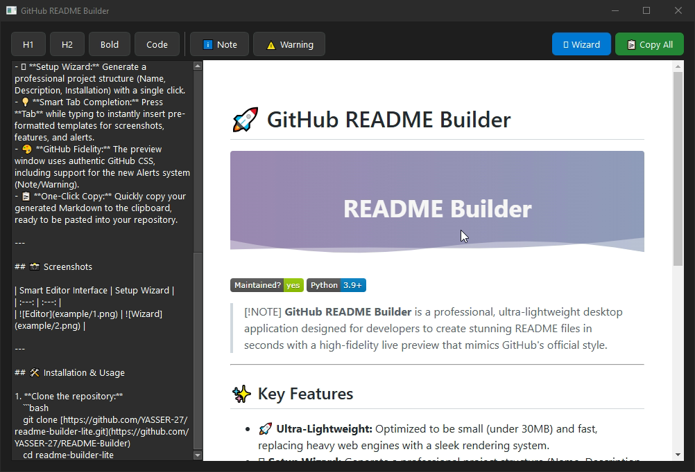

# 🚀 GitHub README Builder


[](https://github.com/YASSER-27)
[](https://www.python.org/)

> [!NOTE]
> **GitHub README Builder** is a professional, ultra-lightweight desktop application designed for developers to create stunning README files in seconds with a high-fidelity live preview that mimics GitHub's official style.

---

## ✨ Key Features

- 🚀 **Ultra-Lightweight:** Optimized to be small (under 30MB) and fast, replacing heavy web engines with a sleek rendering system.
- 🪄 **Setup Wizard:** Generate a professional project structure (Name, Description, Installation) with a single click.
- 💡 **Smart Tab Completion:** Press **Tab** while typing to instantly insert pre-formatted templates for screenshots, features, and alerts.
- 🎨 **GitHub Fidelity:** The preview window uses authentic GitHub CSS, including support for the new Alerts system (Note/Warning).
- 📋 **One-Click Copy:** Quickly copy your generated Markdown to the clipboard, ready to be pasted into your repository.

---

## 📸 Screenshots

| Smart Editor Interface | Setup Wizard |
| :---: | :---: |
|  |  |

---

## 🛠 Installation & Usage

1. **Clone the repository:**
   ```bash
   git clone [https://github.com/YASSER-27/readme-builder-lite.git](https://github.com/YASSER-27/README-Builder)
   cd readme-builder-lite
