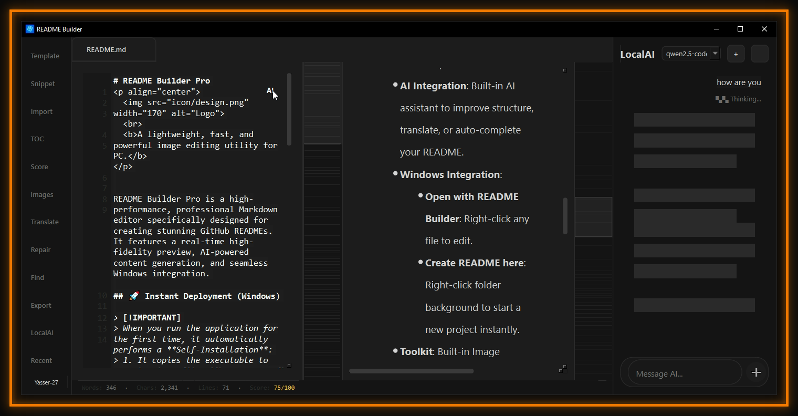
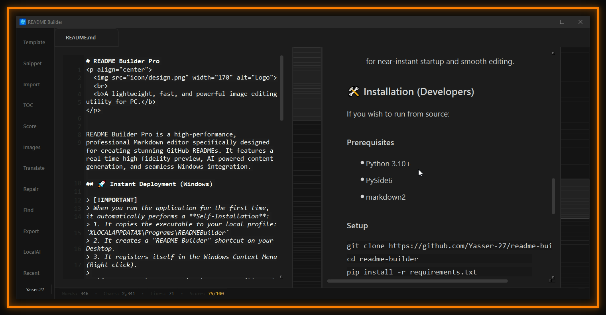
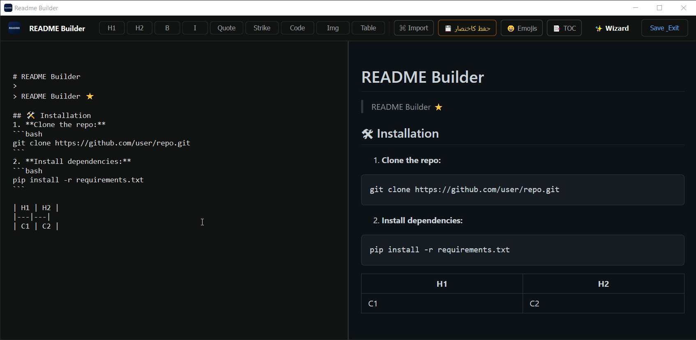
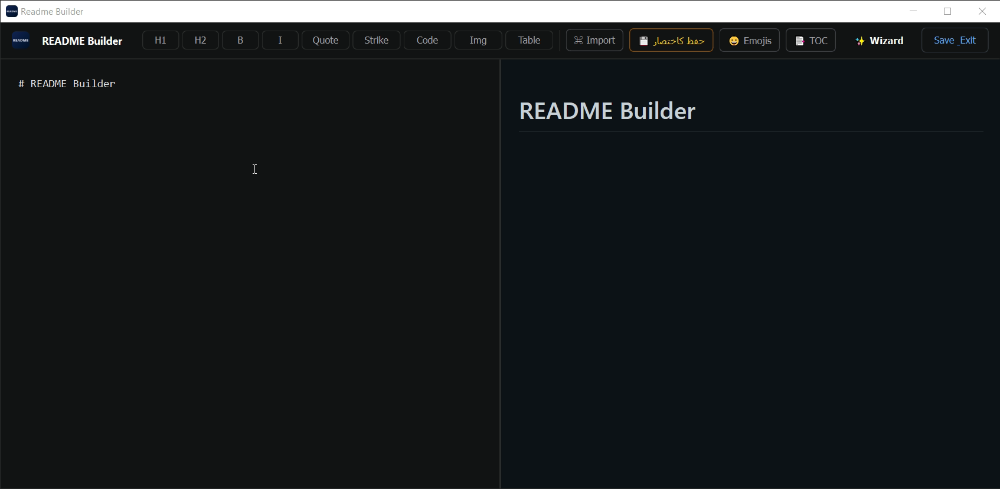
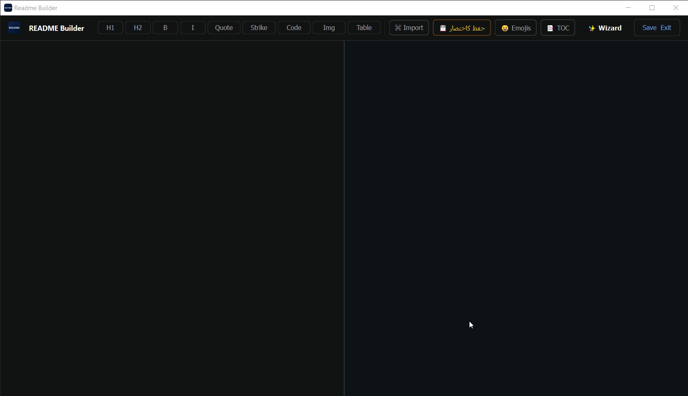
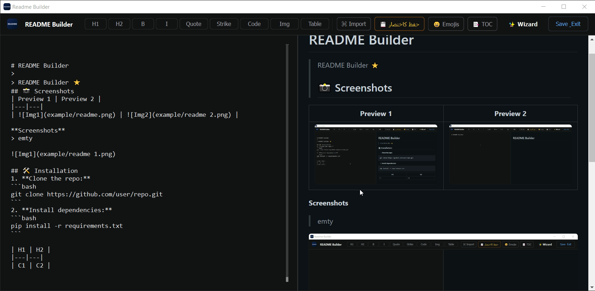

  
   
  <b>README Builder v4.0.0.</b>

  <a href="https://github.com/YASSER-27/README-Builder/releases">
    

> README Builder Pro is a high-performance, professional Markdown editor specifically designed for creating stunning GitHub READMEs. It features a real-time high-fidelity preview, AI-powered content generation, and seamless Windows integration.

> README Builder 66.1 MB
## Instant Deployment (Windows)

> [!IMPORTANT]
> When you run the application for the first time, it automatically performs a **Self-Installation**:
> 1. It copies the executable to your local profile: `%LOCALAPPDATA%\Programs\READMEBuilder`
> 2. It creates a "README Builder" shortcut on your Desktop.
> 3. It registers itself in the Windows Context Menu (Right-click).
>
> This ensures the program is always accessible and performs optimally from a stable location.

## Key Features

- **Fidelity Preview**: Real-time rendering with GitHub-standard styling.
- **Templates**: 15+ professional templates (Web App, CLI, Mobile, Game, etc.) with live preview.
- **AI Integration**: Built-in AI assistant to improve structure, translate, or auto-complete your README.
- **Windows Integration**: 
  - **Open with README Builder**: Right-click any file to edit.
  - **Create README here**: Right-click folder background to start a new project instantly.
- **Toolkit**: Built-in Image Manager, Table Generator, Badge Library, and Automatic TOC generation.
- **Performance**: Native PySide6 implementation for near-instant startup and smooth editing.

 
 

##  Shortcuts

| Shortcut | Action |
|----------|--------|
| `Ctrl + N` | New Tab |
| `Ctrl + S` | Quick Save |
| `Ctrl + T` | Open Templates |
| `Ctrl + I` | Image Manager |
| `Ctrl + F` | Find |
| `F1` | Save Selection as Snippet |
| `F2` | Rename Current Tab |

## 🤝 Contributing

Contributions are welcome! Feel free to fork the repository and submit pull requests.

## 📄 License

This project is licensed under the MIT License.

---

# README Builder 3.0.0
> README Builder 

  

## 📸 Screenshots
| Preview 1 | Preview 2 |
|---|---|
|  |  |
|  |  |

## 🎥 Demo Video

  <video src="https://github.com/user-attachments/assets/9687f2f0-efa7-401b-a9d1-a67082e1c6df" width="100%" autoplay loop muted playsinline>
  </video>

> README Builder
> Downlaod Now Free And Open source [HERE](https://github.com/YASSER-27/README-Builder/releases)

## 🛠 Installation
1. **Download** And Extract: Extract the README Builder ZIP file directly into your C:\ drive (e.g., C:\README-Builder).
2. **Add** Environment Path: Add the C:\README-Builder folder to your system's Environment Variables (Path). This enables the global readme command from any directory.
3. **Run** `add_context_menu.reg`.
4. **Now** right-click > Open with > README **Or** Instant Access: In any folder's Address Bar, simply type readme and press Enter to launch the editor instantly.

> for remove readme from right-click go to RUN and regedit and (Computer\HKEY_CLASSES_ROOT\Directory\Background\shell) and remove folder readme
 
---
Context Menu: Run add_context_menu.reg to add the "Open with README Builder" option to your right-click menu.

Environment Variable (Optional): Add the program path to your system's Path to enable the global readme command.

🛠️ How to Use?
Navigate to any project folder on your PC.

Type readme in the folder's address bar or right-click and select the builder.

Start typing and watch your documentation come to life instantly!

**Done! ✅**

