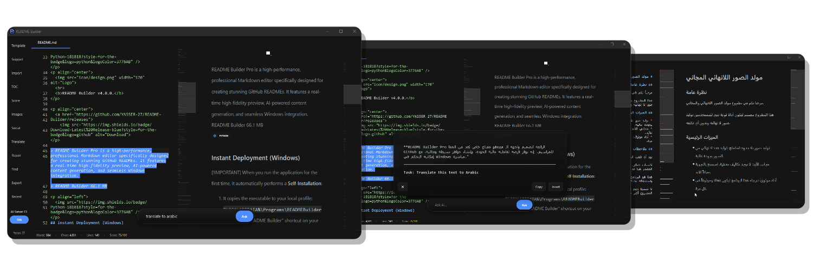
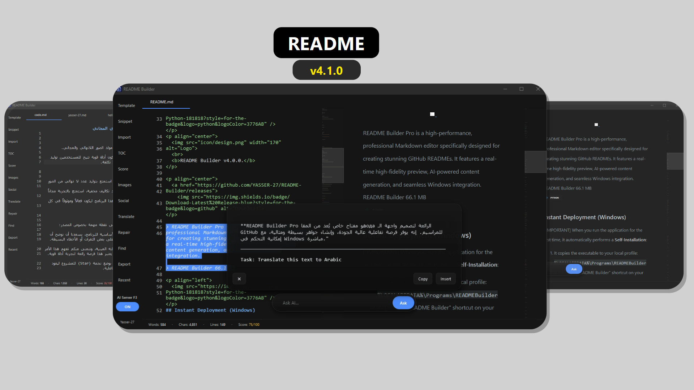
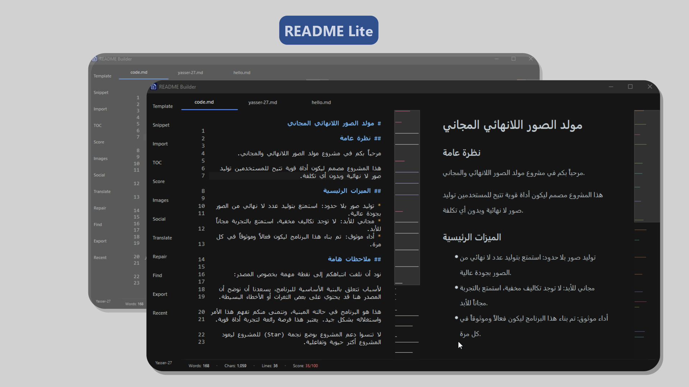
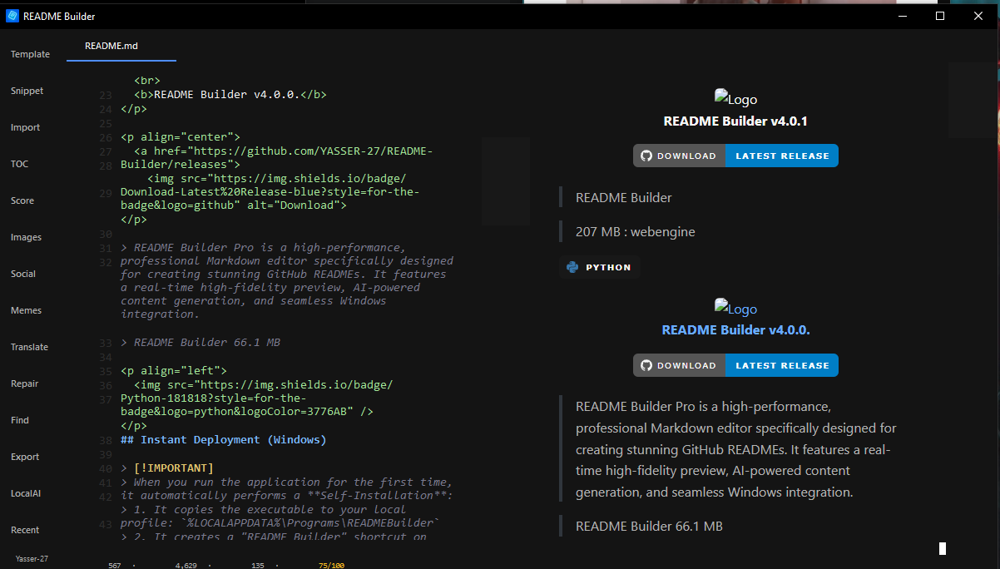
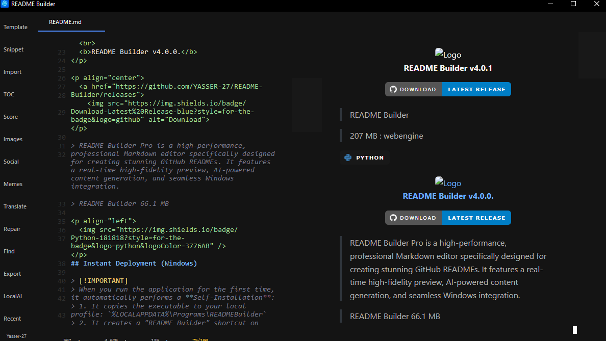
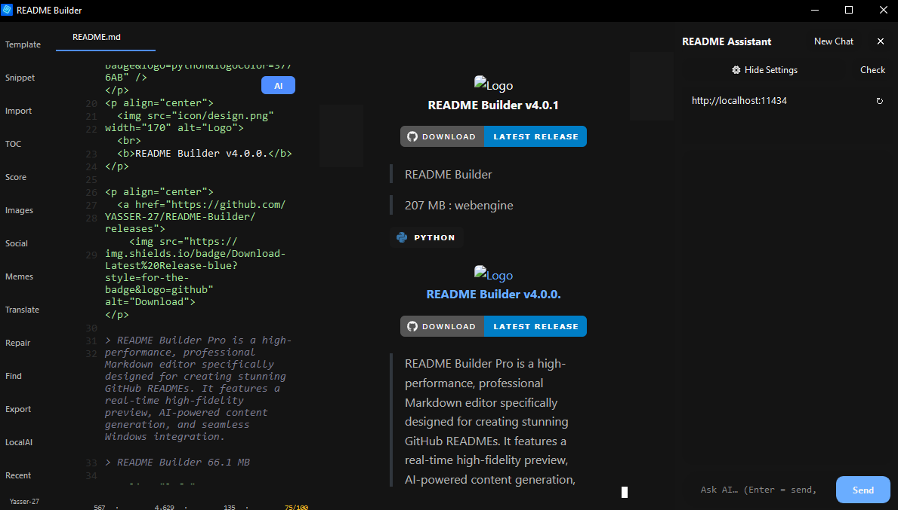
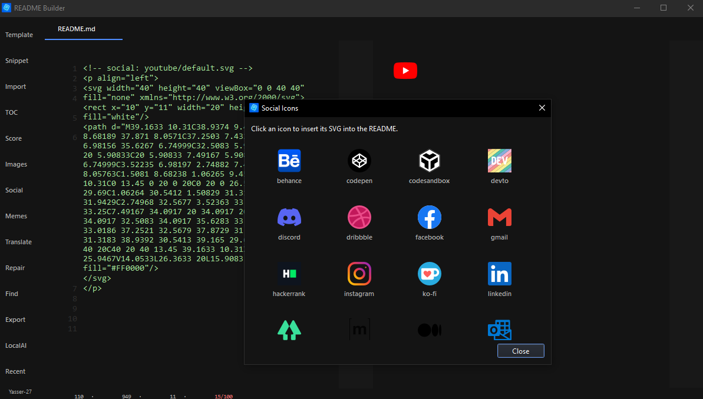
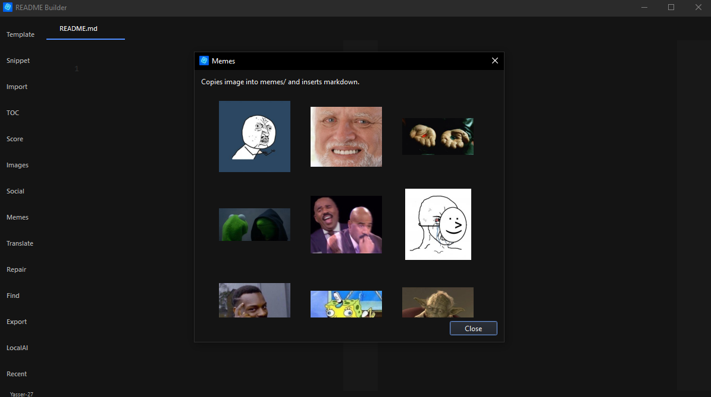
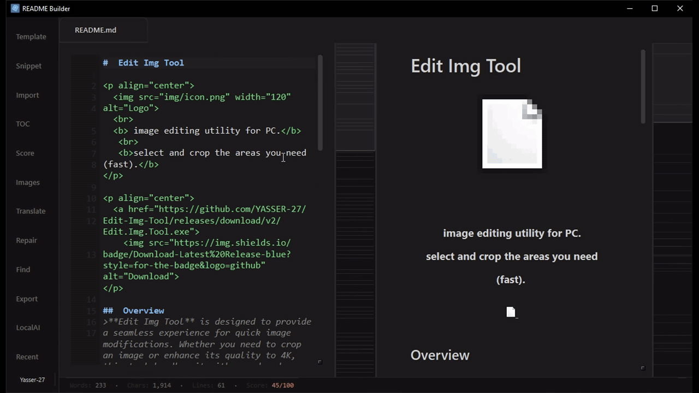
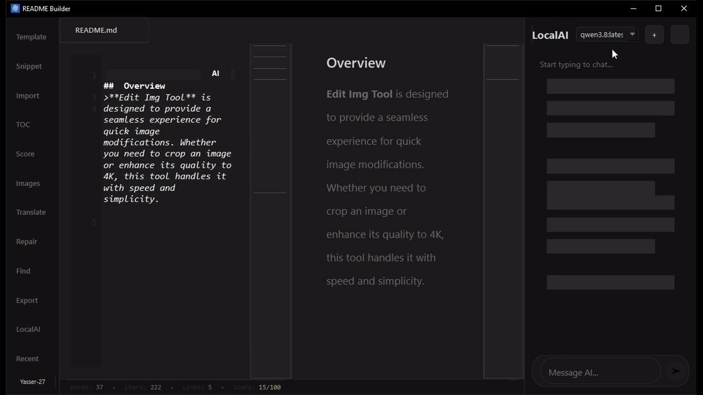

<p align="center">
  
  <h1 align="center">README 4.1.0</h1>
  <p align="center">New version 4.1.0</p>
</p>

> README 4.1.0 consists of two versions:

> 4.1.0 Lite (No AI ) - 10x Faster.

> 4.1.0 AI (Opening is slower because it needs to start the server and connect to the model within README 4.1.0.exe).

**Images**

| AI version | Lite version |
|---|---|
|  |  |

## Installation
1. Clone:
```bash
git clone https://github.com/YASSER-27/README-Builder
```

```bash
Python README_LITE_4.1.0.py
```

**Download**

[Lite version](https://github.com/YASSER-27/README-Builder/releases/download/4.1.0/README.Lite.exe)

[AI version](https://github.com/YASSER-27/README-Builder/releases/download/4.1.0/README.AI.exe)

## How to Use
> The program is very easy to use. Just move it to the **C: drive** inside a folder named **README** (or any name you prefer). When you run it for the first time from that path, the program will automatically integrate with your system. After that, you can easily use it to open existing README files or create new ones.

---

<p align="center">
  
  <br>
  <b>README Builder v4.0.1</b>
</p>

<p align="center">
  <a href="https://github.com/YASSER-27/README-Builder/releases">
    
</p>


> README Builder 

> 207 MB (webengine)

---


| Image | Image |
|---|---|
|  |  |
|  |  |




<p align="left">
  
</p> 
<p align="center">
  
  <br>
  <b>README Builder v4.0.0.</b>
</p>

<p align="center">
  <a href="https://github.com/YASSER-27/README-Builder/releases">
    
</p>

> README Builder Pro is a high-performance, professional Markdown editor specifically designed for creating stunning GitHub READMEs. It features a real-time high-fidelity preview, AI-powered content generation, and seamless Windows integration.

> README Builder 66.1 MB

<p align="left">
  
</p> 
## Instant Deployment (Windows)

> [!IMPORTANT]
> When you run the application for the first time, it automatically performs a **Self-Installation**:
> 1. It copies the executable to your local profile: `%LOCALAPPDATA%\Programs\READMEBuilder`
> 2. It creates a "README Builder" shortcut on your Desktop.
> 3. It registers itself in the Windows Context Menu (Right-click).
>
> This ensures the program is always accessible and performs optimally from a stable location.





## Key Features

- **Fidelity Preview**: Real-time rendering with GitHub-standard styling.
- **Templates**: 15+ professional templates (Web App, CLI, Mobile, Game, etc.) with live preview.
- **AI Integration**: Built-in AI assistant to improve structure, translate, or auto-complete your README.
- **Windows Integration**: 
  - **Open with README Builder**: Right-click any file to edit.
  - **Create README here**: Right-click folder background to start a new project instantly.
- **Toolkit**: Built-in Image Manager, Table Generator, Badge Library, and Automatic TOC generation.
- **Performance**: Native PySide6 implementation for near-instant startup and smooth editing.

 

##  Shortcuts

| Shortcut | Action |
|----------|--------|
| `Ctrl + N` | New Tab |
| `Ctrl + S` | Quick Save |
| `Ctrl + T` | Open Templates |
| `Ctrl + I` | Image Manager |
| `Ctrl + F` | Find |
| `F1` | Save Selection as Snippet |
| `F2` | Rename Current Tab |

## 🤝 Contributing

Contributions are welcome! Feel free to fork the repository and submit pull requests.

## 📄 License

This project is licensed under the MIT License.

---

# README Builder 3.0.0
> README Builder 

<p align="center">
  
</p>

## 📸 Screenshots
| Preview 1 | Preview 2 |
|---|---|
|  |  |
|  |  |

## 🎥 Demo Video
<p align="center">
  <video src="https://github.com/user-attachments/assets/9687f2f0-efa7-401b-a9d1-a67082e1c6df" width="100%" autoplay loop muted playsinline>
  </video>
</p>

> README Builder
> Downlaod Now Free And Open source [HERE](https://github.com/YASSER-27/README-Builder/releases)

## 🛠 Installation
1. **Download** And Extract: Extract the README Builder ZIP file directly into your C:\ drive (e.g., C:\README-Builder).
2. **Add** Environment Path: Add the C:\README-Builder folder to your system's Environment Variables (Path). This enables the global readme command from any directory.
3. **Run** `add_context_menu.reg`.
4. **Now** right-click > Open with > README **Or** Instant Access: In any folder's Address Bar, simply type readme and press Enter to launch the editor instantly.

> for remove readme from right-click go to RUN and regedit and (Computer\HKEY_CLASSES_ROOT\Directory\Background\shell) and remove folder readme
 
---
Context Menu: Run add_context_menu.reg to add the "Open with README Builder" option to your right-click menu.

Environment Variable (Optional): Add the program path to your system's Path to enable the global readme command.

🛠️ How to Use?
Navigate to any project folder on your PC.

Type readme in the folder's address bar or right-click and select the builder.

Start typing and watch your documentation come to life instantly!

**Done! ✅**


